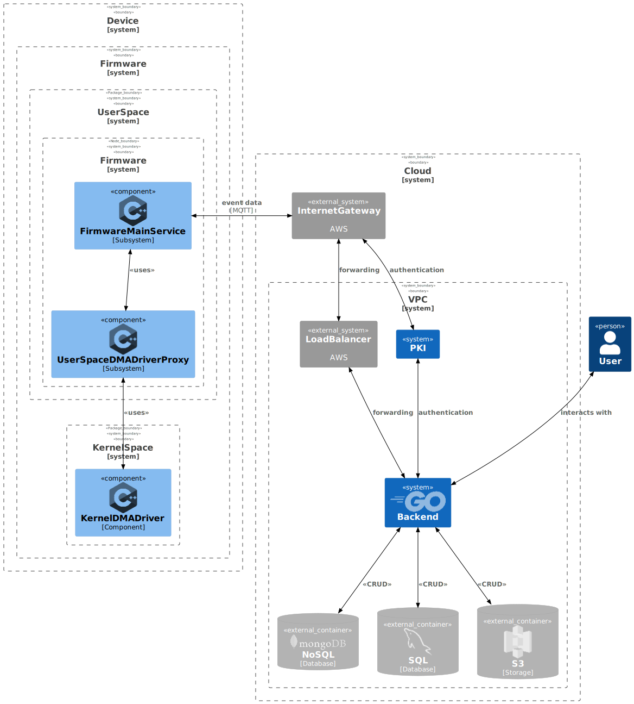
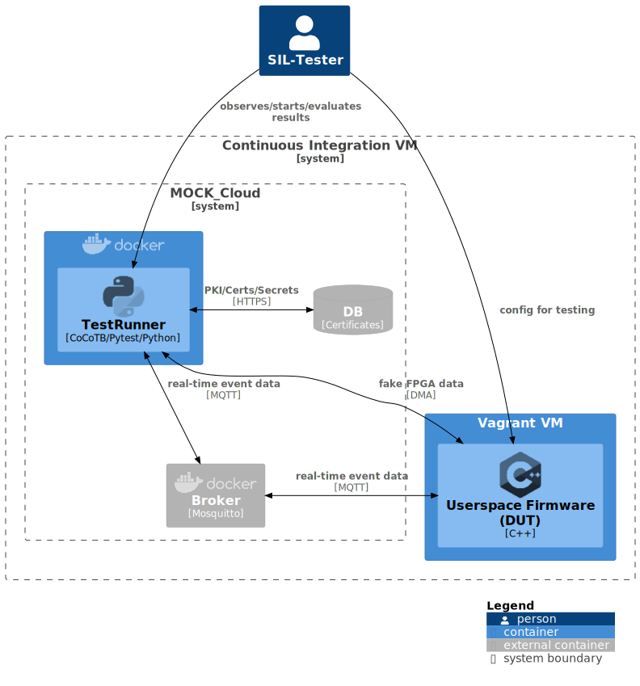
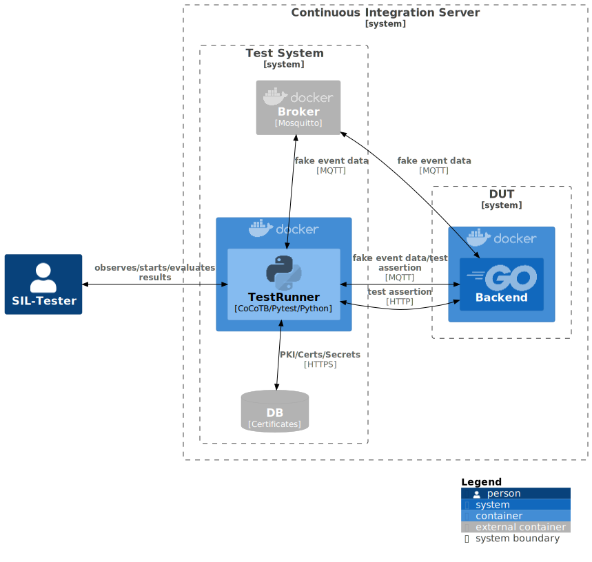
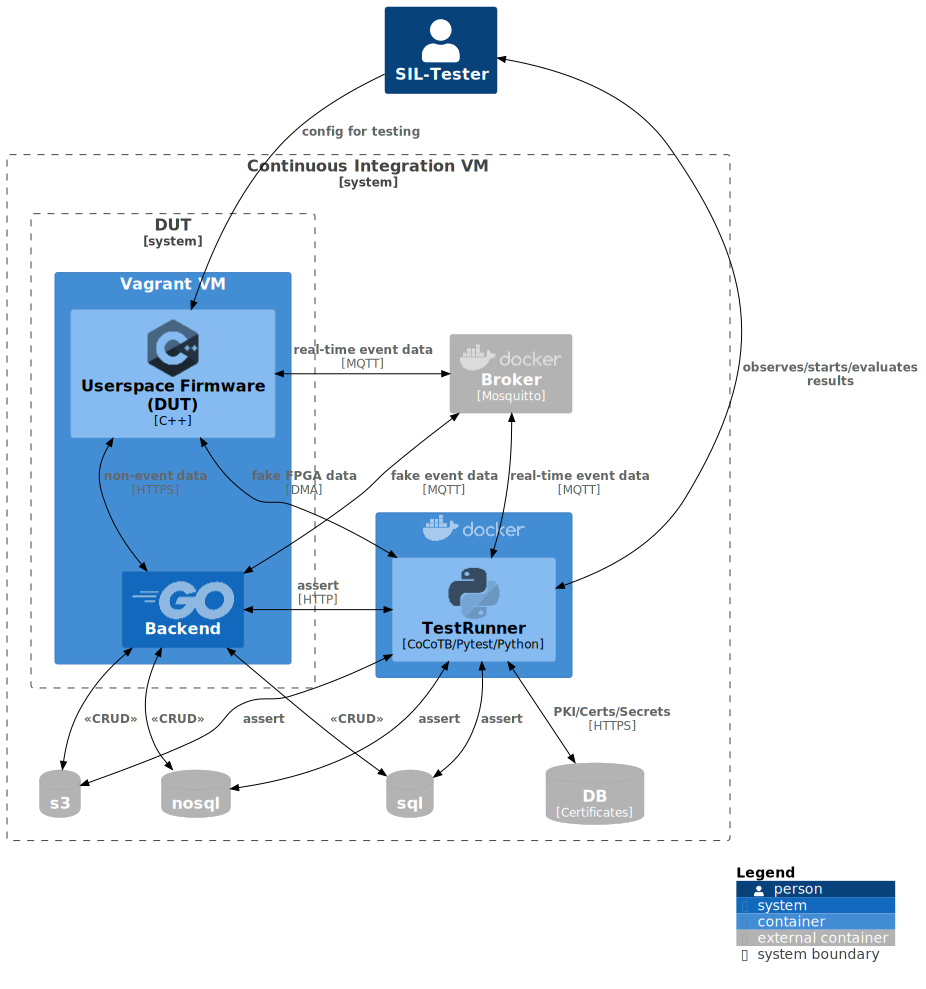

# Introduction

Our recent innovative extension to the Miracle Box edge device in operating rooms, based on the
AMD Zynq UltraScale+ SoC, is the AwesomeSensor. It provides mission critical and highly sensitive data that is stored
and processed by our market leading 8th Wonder Server:

# Tasks

## Task 1

## Task 2

1. Medical data is "**Sensitive Personal Data (PII)**" and must thus be protected accordingly with respect to
regulations and norms (GDPR/HIPAA/ISO-13485 and others).

    => minimal set of non-functional/functional requirements: union of rqs from regulations and norms.

2. **Requirements from "good cyber security practice" apply**:

    1. principle of *least knowledge*: know only what is needed to know
    2. principle of *least permissions*: "it's better to ask for permission that forgiveness"
    3. *CIA principle* must be applied to the system design: *confidentiality, integrity, authenticity*

The above are consequences from threat and risk analysis similar to the following simplified collection:

1. A device may be stolen/altered and data may be extracted.
    > *Example:*
    > *Clinic personal might be bribed to steal devices for data extraction with the goal to blackmail vulnerable individuals.*

2. Data may be stolen/altered from the physical device while the device is operating.
    > *Example:*
    > *Attacker might use an external device to copy data to without altering the device's integrity.*

3. Data may be stolen/altered during data transmission to a connected system.
    > *Example:*
    > *Attacker might conduct an attack (e.g., man-in-the-middle, side-channel) to extract data from a transmission stream*.

4. Data may be stolen/altered during persistence outside of the physical device (backend).
    > *Example:*
    > *Attacker might steal data stored on a hardware-server (database, file, ...).*

The above thoughts lead to the following requirements (acc. to ISO-29148) related to **patient data security**.

1. **Security in Hardware:**

    1. The system shall be securable against theft by  making it mechanically tedious to move or relocate. For example: Kensington Lock, Security bolts.
    1. The system shall not contain hardware interfaces that may be used for data extraction without authenticity check: e.g. USB slot.
    1. The system shall store any secret (encryption key or similar) in a secure element.
    1. The system shall run crypto algorithms in a qualified crypto-co-processor.
    1. The system shall support TPM2.0 or equivalent.
    1. The system shall encrypt non-volatile memory for data persistence.
    1. The system shall support UEFI secure boot or comparable.
    1. The system shall prevent from firmware modification by means of mechanical or electronic design.
    1. The system shall prevent side-channel attacks by proper EMF-shielding.

2. **Security in Software:**

    1. The system shall trigger a loud audible alarm if it looses connection to a third party system. For example: (Heartbeat).
    1. Any symmetric encryption used in the system shall be based on at least AES-256 or equivalent.
    1. Any asymmetric encryption used in the system shall use at least 4096 bits for RSA or equivalent.
    1. TCP/IP connections in the system shall use least TLS 1.3.
    1. The system shall deny any connection to a third party system when its authenticity cannot be verified.
    1. The system shall verify authenticity of a connection peer using a PKI.
    1. The system shall deny any network connection except those that are necessary for secure operation.
    1. The system shall not persist data or meta-data related to human individuals (PII) in non-volatile memory.
    1. The system shall receive over-the-air updates for its firmware.
    1. The system shall shall offer a A/B update mechanism.
    1. The system shall deny firmware modification due to software packages that have not been signed by trusted authority.
    1. The system shall log any interaction with itself and other systems.

## Task 3: SWA

> Draft a software architecture fulfilling these requirements that reads the data,
> transfers it to the server and processes the data on the server.

**The SWA draft makes the following assumptions:**

1. certain "real-time" data shall be sent to the server using MQTT
1. data is "small enough" to be sent using MQTT, i.e., no large video data or similar
1. the SWA is a service oriented architecture on both ends; cloud-side may leverage things like IOTCore from AWS.

### Subsystem Responsibilities

1. **Firmware Responsibilities**:

    1. **Data Retrieval**: Take-over raw DMA data from FPGA DMA user space driver
    2. **Pseudonymization**: Strip data from information that is not need be known in the backend ("principle of least knowledge"), or instruct FPGA to do so for performance reasons.
    1. **Add Meta-Data**: for bookkeeping, data may need be extended with meta information that allows processing the data without corrupting pseudonymity.
    3. **Secure Connection**: establish secure connection with backend (TLS) and exchange shared secret
    3. **Encryption**: Encrypt data using shared secret (symmetric), ideally on FPGA
    3. **Data Upload**: Trigger data upload
    4. **Secure Data Erasure**: Secure data removal from device.
    5. **Query for FW Updates**: ask backend whether firmware update can be applied and notify users

2. **Backend Responsibilities**:
    1. serve firmware updates
    2. serve **MQTT brokerage with TLS 1.3** support using **PKI**
    3. establish secure connection with firmware (TLS) and exchange shared secret
    3. decrypt data with shared secret
    3. process data according to the relevant business logic/request/type
    4. encrypt and store data according to its type in the relevant data base

3. **Other Responsibilities**:
    1. A virtual private cloud hides the application from the public internet.
    2. a load balancer forwards requests according to the current load to one of many instances of the same backend (or its sub-services) and thus performs horizontal scaling.

## Task 4:

### Notes:

The following requirements have not been implemented in the prototype (where applicable):

1. TLS can be enabled in the MQTT client.
2. Derivation of a shared secret for end-to-end or similar encryption.
3. Transferal of a session key to the fpga for accelerated encryption.
4. For simplification the code has been written in python, enabling an end-to-end test (system level) with simulated FPGA input according to the challenge of Task 4 (*Full Virtual Integration Test*).

## Task 5: SIL Testing

> *Unfortunately, we ran out of Miracle Boxes and the lead time is very long. We cannot provide any hardware to you.
> How can you verify the solution?*

Testing all requirements (especially non-functional ones (performance!)) is only possible on the final assembly.
Up to a certain point, requirements can be tested in SIL-fashioned system and integration tests as sketched in the following C4 diagram.

### Testing the Firmware

The following images gives a possible, rough setup for an component test of the firmware subsystem.

In this case, the test-runner's test-cases
1. faking events and requests
2. and finally check whether the expected

    1. responses,
    2. events,
    3. and data

    has been generated by accessing data-bases and subscribing to topics.

### Testing the Backend

The following images gives a possible, rough setup for an component test of the backend subsystem.

In this case, the test-runner's test-cases
1. faking events and requests
2. and finally check whether the expected

    1. responses,
    2. events,
    3. and data

    has been generated by accessing data-bases and subscribing to topics.

### Full Virtual Integration Test

The following images gives a possible, rough setup for an integration test between the two main sub-systems.

In this case, the test-runner's test-cases
1. fake FPGA-read sensor data (*cocotb*)
2. and finally check whether the expected

    1. requests,
    2. events,
    3. and data

    has been generated by accessing data-bases and subscribing to topics.

